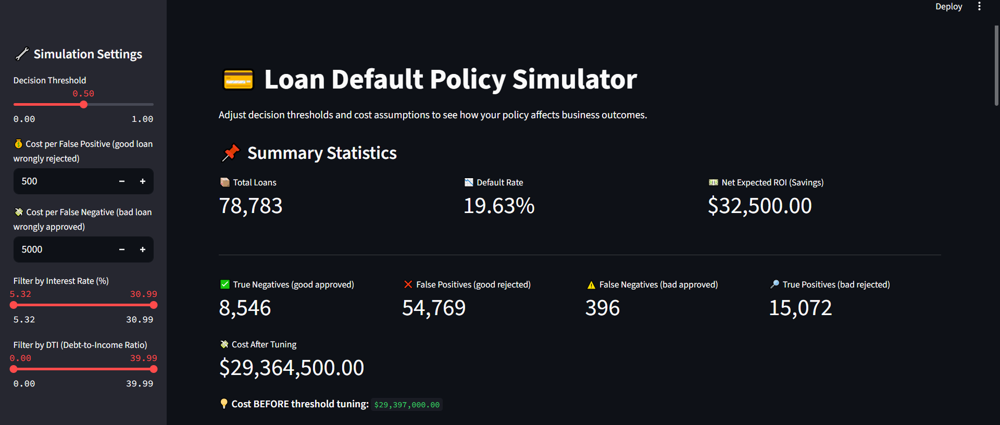
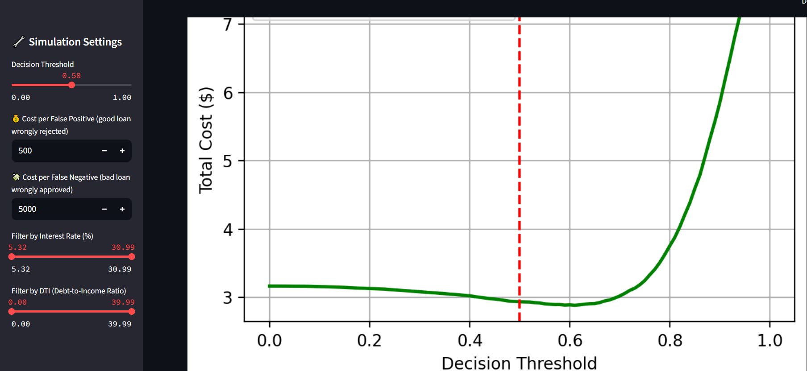

# 📊 LoanLens – ML-Powered Credit Risk Dashboard

> An interactive dashboard that predicts loan defaults in real-time, simulates decision thresholds, and shows business impact for lenders.

## 🚀 Problem Statement
Lenders often approve loans without understanding risk trade-offs.  
**LoanLens** provides:
- Dynamic decision threshold tuning
- Real-time cost impact (e.g., savings vs baseline)
- Risk slicing by interest rate and DTI

## 💡 Features
✅ Interactive Streamlit dashboard  
✅ Dynamic confusion matrix & Decision threshold tuning distribution  
✅ Business KPI calculation (Cost Before vs Cost After threshold tuning)  
✅ Slicing filters (Interest Rate, DTI)  
✅ Model trained on **LendingClub loan dataset** with XGBoost

## 📂 Project Structure

LoanLens/
├── app.py
├── requirements.txt
├── data/
├── notebooks/
└── model/

## ⚙️ Tech Stack
- **Backend / ML:** Python, scikit-learn, XGBoost
- **Dashboard:** Streamlit
- **Data Visualization:** Matplotlib, Seaborn
- **Deployment Ready:** Requirements.txt, Saved model

## 📈 Business Impact
- **Cost BEFORE tuning:** $29,355,000.00  (calculated from base model performance and cost assumptions)
- **Simulated Cost AFTER tuning:** dynamically calculated in dashboard  
- **Savings:** displayed in real-time for decision makers

## Future Improvements 
- Fine tune XGB model with hyperparameters (when I have a better laptop haha as it is taking too long)
- Experiment with ANNs 
- Use a FastAPI backend to do real time loan default prediction
